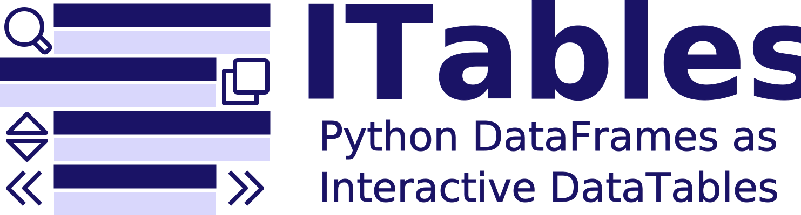

[](https://codecov.io/github/mwouts/itables?branch=main)
[](https://pypi.python.org/pypi/itables)
[](https://anaconda.org/conda-forge/itables)
[](https://pypi.python.org/pypi/itables)
[](https://github.com/psf/black)

This packages changes how Pandas and Polars DataFrames are rendered in Jupyter Notebooks.
With `itables` you can display your tables as interactive [DataTables](https://datatables.net/)
that you can sort, paginate, scroll or filter.

ITables is just about how tables are displayed. You can turn it on and off in just two lines,
with no other impact on your data workflow.

The `itables` package only depends on `numpy`, `pandas` and `IPython`
which you must already have if you work with Pandas in Jupyter (add `polars`, `pyarrow` if you
work with Polars DataFrames).

## Documentation

Browse the [documentation](https://mwouts.github.io/itables/) to see
examples of Pandas or Polars DataFrames rendered as interactive DataTables.

## Quick start

Install the `itables` package with either
```shell
pip install itables
```

or
```shell
conda install itables -c conda-forge
```

Activate the interactive mode for all series and dataframes with
```python
from itables import init_notebook_mode

init_notebook_mode(all_interactive=True)
```
and then render any DataFrame as an interactive table that you can sort, search and explore:


If you prefer to render only selected DataFrames as interactive tables, use `itables.show` to show just one Series or DataFrame as an interactive table:


Since `itables==1.0.0`, the [jQuery](https://jquery.com/) and [DataTables](https://datatables.net/) libraries and CSS
are injected in the notebook when you execute `init_notebook_mode` with its default argument `connected=False`.
Thanks to this the interactive tables will work even without a connection to the internet.

If you prefer to load the libraries dynamically (and keep the notebook lighter), use `connected=True` when you
execute `init_notebook_mode`.

## Supported environments

`itables` has been tested in the following editors:
- Jupyter Notebook
- Jupyter Lab
- Jupyter nbconvert (i.e. the tables are still interactive in the HTML export of a notebook)
- Jupyter Book
- Google Colab
- VS Code (for both Jupyter Notebooks and Python scripts)
- PyCharm (for Jupyter Notebooks)
- Quarto
- Shiny for Python
