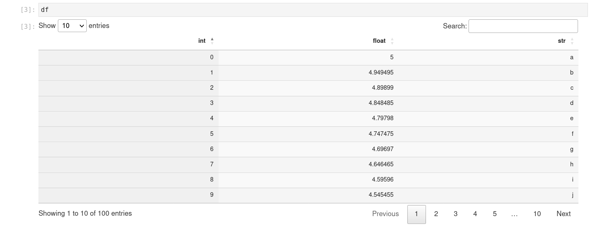
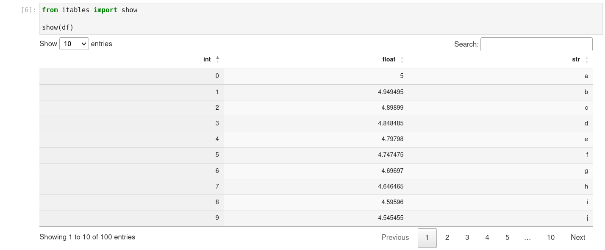

[](https://github.com/mwouts/itables/actions)
[](https://codecov.io/github/mwouts/itables?branch=main)
[](LICENSE)
[](https://pypi.python.org/pypi/itables)
[](https://anaconda.org/conda-forge/itables)
[](https://pypi.python.org/pypi/itables)
 
[](https://github.com/psf/black)
[](https://mwouts.github.io/itables/apps/widget.html)
[](https://mwouts.github.io/itables/apps/dash.html)
[](https://itables.streamlit.app)

This packages changes how Pandas and Polars DataFrames are rendered in Python notebooks and applications.
With `itables` you can display your tables as interactive [DataTables](https://datatables.net/)
that you can sort, paginate, scroll or filter.

ITables is just about how tables are displayed. You can turn it on and off in just two lines,
with no other impact on your data workflow.

The `itables` package only depends on `numpy`, `pandas` and `IPython`
which you must already have if you work with Pandas in Jupyter (add `polars`, `pyarrow` if you
work with Polars DataFrames).

## Documentation

Browse the [documentation](https://mwouts.github.io/itables/) to see
examples of Pandas or Polars DataFrames rendered as interactive DataTables.

## Quick start

Install the `itables` package with either
```shell
pip install itables
```

or
```shell
conda install itables -c conda-forge
```

Activate the interactive mode for all series and dataframes in Jupyter with
```python
import itables

itables.init_notebook_mode()
```
and then render any DataFrame as an interactive table that you can sort, search and explore:


If you prefer to render only selected DataFrames as interactive tables, call `itables.init_notebook_mode(all_interactive=False)`, then use `itables.show` to show just one Series or DataFrame as an interactive table:



## ITables in Notebooks

ITables works in all the usual Jupyter Notebook environments, including Jupyter Notebook, Jupyter Lab, Jupyter nbconvert (i.e. the tables are still interactive in the HTML export of a notebook), Jupyter Book, Google Colab and Kaggle.

You can also use ITables in [Quarto](https://mwouts.github.io/itables/quarto.html) HTML documents, and in RISE presentations.

ITables works well in VS Code, both in Jupyter Notebooks and in interactive Python sessions.

## ITables in Python applications

ITables is also available as
- a [Jupyter Widget](https://mwouts.github.io/itables/widget.html)
- a [Dash](https://mwouts.github.io/itables/dash.html) component
- a [Streamlit](https://mwouts.github.io/itables/streamlit.html) component,
- and it also works in [Shiny](https://mwouts.github.io/itables/shiny.html) applications.

## Licence

ITables is developed by [Marc Wouts](https://github.com/mwouts) on [GitHub](https://github.com/mwouts/itables),
under a MIT license.

ITables is a wrapper for [datatables.net](https://datatables.net/) which is developed by Allan Jardine
[(sponsor him!)](https://github.com/sponsors/AllanJard), also under a MIT license.
