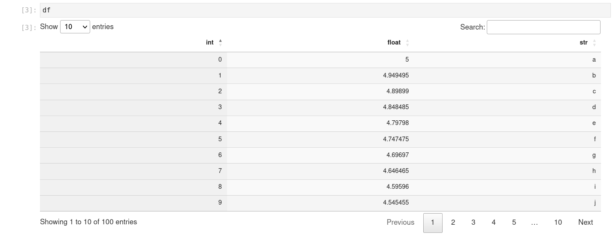
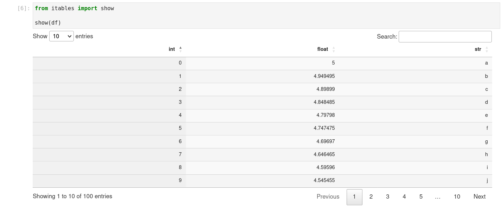

[](https://github.com/mwouts/itables/actions)
[](https://codecov.io/github/mwouts/itables?branch=main)
[](LICENSE)
[](https://pypi.python.org/pypi/itables)
[](https://anaconda.org/conda-forge/itables)
[](https://pypi.python.org/pypi/itables)
 
[](https://github.com/psf/black)
[](https://mwouts.github.io/itables/apps/widget.html)
[](https://mwouts.github.io/itables/apps/dash.html)
[](https://itables.streamlit.app)

ITables changes how Pandas and Polars DataFrames are rendered in Python notebooks
and applications: your tables become interactive - you can sort, paginate,
scroll, search and filter them.

ITables is just about how tables are displayed. You can turn it on and off in
just two lines, with no other impact on your data workflow.

## Two renderers: DataTables and AG Grid

The ITables project offers **two rendering packages** with the same Python API,
but a different look, feel and set of options:

| | [`pydatatables`](python/pydatatables) | [`pyaggrid`](python/pyaggrid) |
| --- | --- | --- |
| Rendering library | [DataTables](https://datatables.net/) (MIT) | [AG Grid Community](https://www.ag-grid.com/) (MIT) |
| Look | The classic DataTables look, with [style classes](https://mwouts.github.io/itables/options/classes.html) | The modern AG Grid themes: `quartz`, `balham`, `material`, `alpine` |
| Options | The [DataTables options](https://datatables.net/reference/option/): `layout`, `buttons`, `searchPanes`, `rowGroup`, ... | The [AG Grid options](https://www.ag-grid.com/javascript-data-grid/grid-options/): `columnDefs`, `rowSelection`, `quickFilterText`, ... |
| Offline mode | Yes (`init_notebook_mode(connected=False)`) | Not yet (AG Grid is loaded from jsDelivr) |
| Jupyter Widget, Dash, Streamlit, Shiny components | Yes | Not yet |
| Maturity | Stable - this is the historical ITables renderer | New |

Both packages share the same core functions through [`itables_core`](python/itables_core):
large tables are [downsampled](https://mwouts.github.io/itables/downsampling.html) to
`maxBytes`/`maxRows`/`maxColumns` before being rendered, the table values are
formatted identically, and JavaScript callbacks can be passed with `JavascriptFunction`.

Both work out of the box with Pandas or Polars in Jupyter, and with Narwhals
installed they can also display DataFrames from other libraries like cuDF,
Modin or PyArrow. Neither has required dependencies beyond `itables_core`.

## Quick start with pydatatables (DataTables)

```shell
pip install pydatatables
```

Activate the interactive mode for all series and dataframes in Jupyter with
```python
import pydatatables

pydatatables.init_notebook_mode()
```
and then render any DataFrame as an interactive table that you can sort, search and explore:


If you prefer to render only selected DataFrames as interactive tables, call
`pydatatables.init_notebook_mode(all_interactive=False)`, then use
`pydatatables.show` to show just one Series or DataFrame as an interactive table:


## Quick start with pyaggrid (AG Grid)

```shell
pip install pyaggrid
```

then render your DataFrames as AG Grid tables with
```python
import pyaggrid

pyaggrid.init_notebook_mode()  # all DataFrames become interactive, or
pyaggrid.show(df, theme="quartz", rowSelection={"mode": "multiRow"})
```

## The historical `itables` package

The `itables` package is now a thin backward-compatible wrapper around
`pydatatables`. Existing users can keep using it unchanged - `import itables`,
`itables.show`, `itables.options`, `from itables.widget import ITable`, etc.
all keep working:

```shell
pip install itables
```

## Project structure

The ITables project is developed in this repository and is distributed as several Python packages:

| Package | Description |
| ------- | ----------- |
| [`pydatatables`](python/pydatatables) | Python DataFrames as interactive [DataTables](https://datatables.net/) |
| [`pyaggrid`](python/pyaggrid) | Python DataFrames as interactive [AG Grid](https://www.ag-grid.com/) tables |
| [`itables_core`](python/itables_core) | The core functions (downsampling, formatting) shared by the two renderers |
| [`itables`](python/itables) | The historical package, now a backward-compatible wrapper around `pydatatables` |

## Documentation

Both renderers are documented on a single website: browse the
[documentation](https://mwouts.github.io/itables/) to see examples of Pandas
or Polars DataFrames rendered with [DataTables](https://mwouts.github.io/itables/quick_start.html)
or with [AG Grid](https://mwouts.github.io/itables/pyaggrid.html).

## ITables in Notebooks

ITables works in all the usual Jupyter Notebook environments, including Jupyter Notebook, Jupyter Lab, Jupyter nbconvert (i.e. the tables are still interactive in the HTML export of a notebook), Jupyter Book, Google Colab and Kaggle.

You can also use ITables in [Quarto](https://mwouts.github.io/itables/quarto.html) HTML documents, and in RISE presentations.

ITables works well in VS Code, both in Jupyter Notebooks and in interactive Python sessions.

## ITables in Python applications

The DataTables renderer (`pydatatables`) is also available as
- a [Jupyter Widget](https://mwouts.github.io/itables/apps/widget.html)
- a [Dash](https://mwouts.github.io/itables/apps/dash.html) component
- a [Streamlit](https://mwouts.github.io/itables/apps/streamlit.html) component,
- and it also works in [Shiny](https://mwouts.github.io/itables/apps/shiny.html) applications.

The corresponding `pyaggrid` components are not available yet.

## Licence

ITables is developed by [Marc Wouts](https://github.com/mwouts) on [GitHub](https://github.com/mwouts/itables),
under an MIT license.

The `pydatatables` renderer is a wrapper for [datatables.net](https://datatables.net/) which is developed by Allan Jardine
[(sponsor him!)](https://github.com/sponsors/AllanJard), also under an MIT license.

The `pyaggrid` renderer uses [AG Grid Community](https://github.com/ag-grid/ag-grid),
which is developed by AG Grid Ltd under an MIT license.
