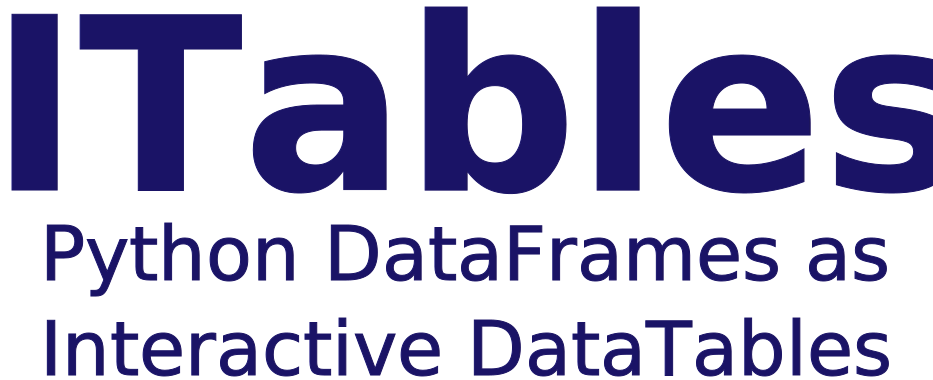

---
jupytext:
  formats: docs///md:myst,docs/py///py:percent
  notebook_metadata_filter: -jupytext.text_representation.jupytext_version
  text_representation:
    extension: .md
    format_name: myst
    format_version: 0.13
kernelspec:
  display_name: itables
  language: python
  name: itables
---

```{code-cell} ipython3
:tags: [remove-cell]

# ruff: noqa: E402
# pyright: reportUnusedExpression=false
```



[](https://github.com/mwouts/itables/actions)
[](https://codecov.io/github/mwouts/itables?branch=main)
[](https://github.com/mwouts/itables/blob/main/LICENSE)
[](https://pypi.python.org/pypi/itables)
[](https://anaconda.org/conda-forge/itables)
[](https://pypi.python.org/pypi/itables)
<a class="github-button" href="https://github.com/mwouts/itables" data-icon="octicon-star" data-show-count="true"></a>
<script src="https://buttons.github.io/buttons.js"></script>

# Welcome to ITables

ITables changes how Pandas and Polars DataFrames are rendered in Python
notebooks and applications: your tables become interactive - you can sort,
paginate, scroll, search and filter them.

ITables is just about how tables are displayed. You can turn it on and off
in just two lines, with no other impact on your data workflow.

The ITables project offers **two rendering packages**, with the same Python
API but a different look, feel and set of options. Both are demonstrated
below with a live table.

## PyDataTables: the DataTables renderer

The [`pydatatables`](https://pypi.org/project/pydatatables/) package
(the historical ITables renderer) displays your DataFrames with
[DataTables](https://datatables.net/):

```{code-cell} ipython3
:tags: [full-width]

import pydatatables

df = pydatatables.sample_dfs.get_countries()
pydatatables.show(df)
```

Start with the [Quick Start](quick_start.md), then browse the
[DataTables options](options/options.md).

## PyAgGrid: the AG Grid renderer

The [`pyaggrid`](https://pypi.org/project/pyaggrid/) package displays the
same DataFrames with [AG Grid](https://www.ag-grid.com/):

```{code-cell} ipython3
:tags: [full-width]

import pyaggrid

pyaggrid.show(df, theme="quartz")
```

Read more in the [PyAgGrid documentation](pyaggrid.md).

## Which renderer should I choose?

| | `pydatatables` | `pyaggrid` |
| --- | --- | --- |
| Rendering library | [DataTables](https://datatables.net/) (MIT) | [AG Grid Community](https://www.ag-grid.com/) (MIT) |
| Look | The classic DataTables look, with [style classes](options/classes.md) | The modern AG Grid themes: `quartz`, `balham`, `material`, `alpine` |
| Options | The [DataTables options](options/options.md): `layout`, `buttons`, `searchPanes`, `rowGroup`, ... | The [AG Grid options](https://www.ag-grid.com/javascript-data-grid/grid-options/): `columnDefs`, `rowSelection`, `quickFilterText`, ... |
| Offline mode | Yes ([`init_notebook_mode(connected=False)`](apps/notebook.md)) | Not yet (AG Grid is loaded from jsDelivr) |
| [Jupyter Widget](apps/widget.md), [Dash](apps/dash.md), [Streamlit](apps/streamlit.md), [Shiny](apps/shiny.md) components | Yes | Not yet |
| Maturity | Stable - developed since 2019 | New |

Whichever renderer you choose, you get the same Python experience: activate
the interactive mode for all your DataFrames with `init_notebook_mode()`, or
display a single table with `show(df)`. Large tables are
[downsampled](downsampling.md) to `maxBytes`/`maxRows`/`maxColumns` before
being rendered, the table values are formatted identically, and JavaScript
callbacks can be passed with `JavascriptFunction` - these core functions are
shared by the two packages through
[`itables_core`](https://pypi.org/project/itables-core/).

## The historical `itables` package

The [`itables`](https://pypi.org/project/itables/) package is now a thin
backward-compatible wrapper around `pydatatables`. Existing users can keep
using it unchanged: `import itables`, `itables.show`, `itables.options`,
`from itables.widget import ITable`, etc. all keep working.

## Licence

ITables is developed by [Marc Wouts](https://github.com/mwouts) on
[GitHub](https://github.com/mwouts/itables), under an MIT license.

The `pydatatables` renderer is a wrapper for
[datatables.net](https://datatables.net/) which is developed by Allan Jardine
[(sponsor him!)](https://github.com/sponsors/AllanJard), also under an MIT
license. The `pyaggrid` renderer uses
[AG Grid Community](https://github.com/ag-grid/ag-grid), which is developed
by AG Grid Ltd under an MIT license.
