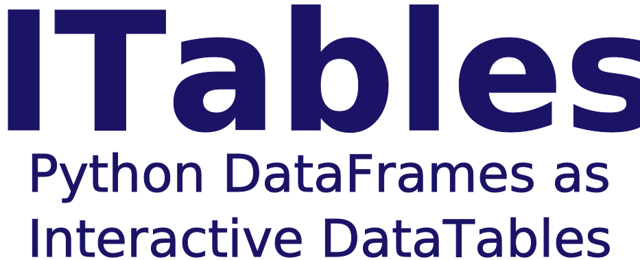

---
jupytext:
  formats: md:myst
  notebook_metadata_filter: -jupytext.text_representation.jupytext_version
  text_representation:
    extension: .md
    format_name: myst
    format_version: 0.13
kernelspec:
  display_name: itables
  language: python
  name: itables
---




[](https://codecov.io/github/mwouts/itables?branch=main)
[](https://pypi.python.org/pypi/itables)
[](https://anaconda.org/conda-forge/itables)
[](https://pypi.python.org/pypi/itables)
[](https://github.com/psf/black)
<a class="github-button" href="https://github.com/mwouts/itables" data-icon="octicon-star" data-show-count="true"></a>
<script src="https://buttons.github.io/buttons.js"></script>

This packages changes how Pandas and Polars DataFrames are rendered in Jupyter Notebooks.
With `itables` you can display your tables as interactive [DataTables](https://datatables.net/)
that you can sort, paginate, scroll or filter.

ITables is just about how tables are displayed. You can turn it on and off in just two lines,
with no other impact on your data workflow.

The `itables` package depends only on `numpy`, `pandas` and `IPython`
which you must already have if you work with Pandas in Jupyter (add `polars`, `pyarrow` if you
work with Polars DataFrames).

# Quick Start

## Installation

Install the `itables` package with either

```shell
pip install itables
```

or
```shell
conda install itables -c conda-forge
```

## Activate ITables in a Notebook

Activate the interactive mode in notebook-like environment with `init_notebook_mode`:

```{code-cell}
from itables import init_notebook_mode

init_notebook_mode(all_interactive=True)
```

After this, any Pandas or Polars DataFrame, or Series,
is displayed as an interactive [DataTables](https://datatables.net/),
which lets you explore, filter or sort your data.

```{code-cell}
from itables.sample_dfs import get_countries

df = get_countries(html=False)
df
```

If you prefer to render only certain tables using `itables`, or want
to pass [advanced parameters](advanced_parameters.md) along with the
DataFrame, use `show`:

```{code-cell}
from itables import show

show(df, lengthMenu=[2, 5, 10, 25, 50, 100, 250])
```

## Offline mode versus connected mode

ITables use two Javascript libraries:
[jQuery](https://jquery.com/) and [DataTables](https://datatables.net/).

By default `itables` works offline. No internet connection is required
as the two libraries are embedded into the notebook itself
when you execute `init_notebook_mode`.

In some contexts (Jupyter Book, Jupyter Colab, etc...) you might
prefer to load the libraries dynamically from the internet.
To do so, add the argument `connected=True` when you
execute `init_notebook_mode`. This will also make your notebook lighter by
about [700kB](https://github.com/mwouts/itables/blob/main/tests/test_connected_notebook_is_small.py).

## Try ITables on Binder

You can run the examples above (or any other documentation page) directly on , without having to install anything on your end - just click on the rocket icon at the top of the page.
