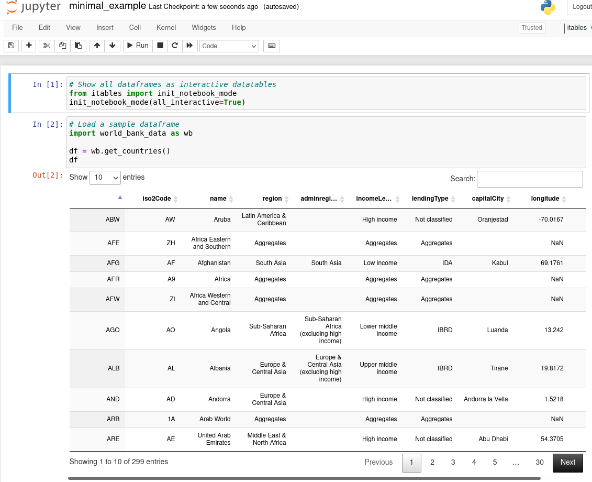
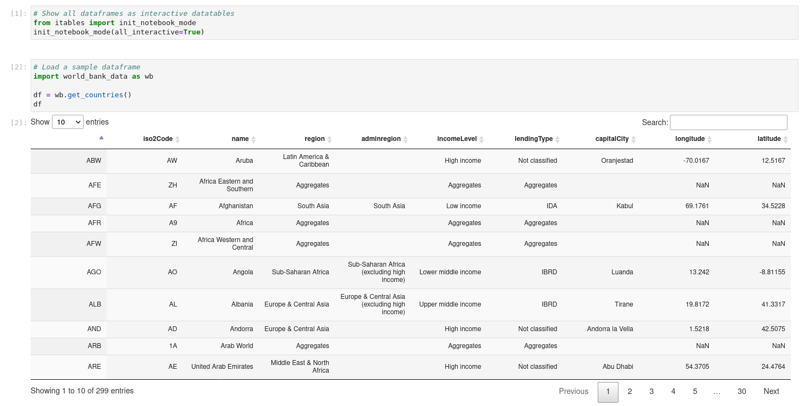
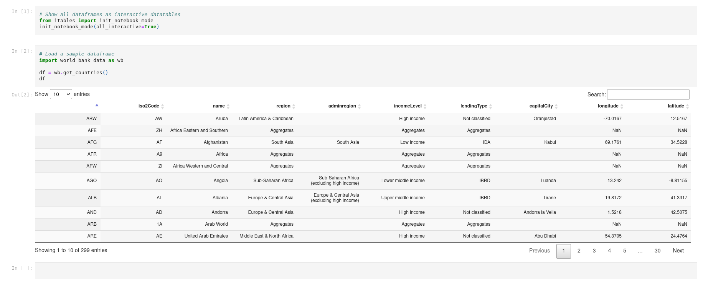
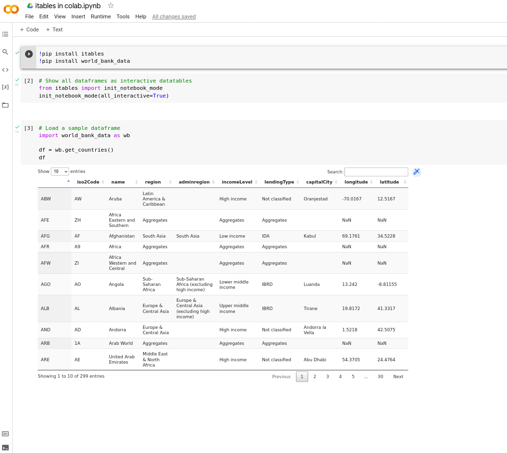
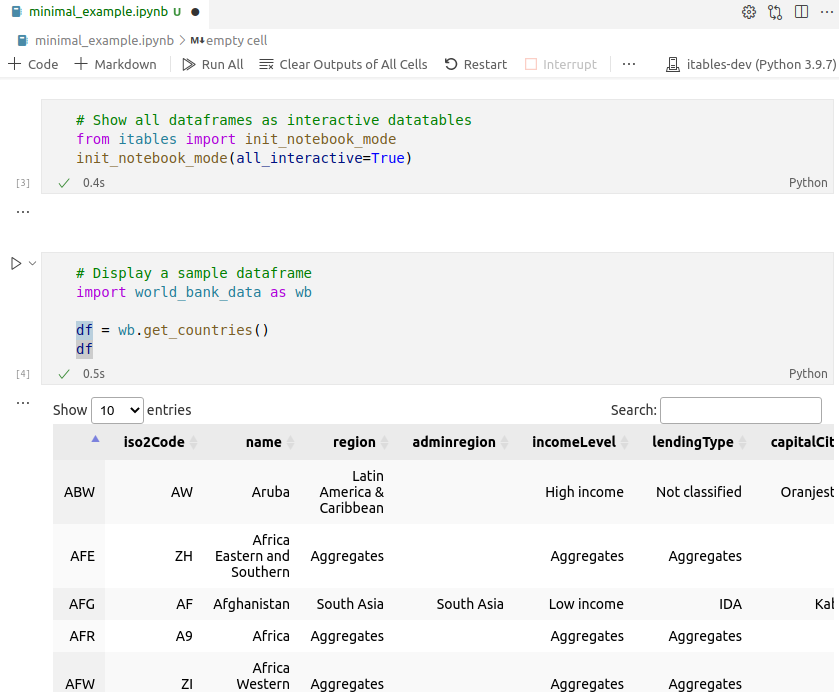
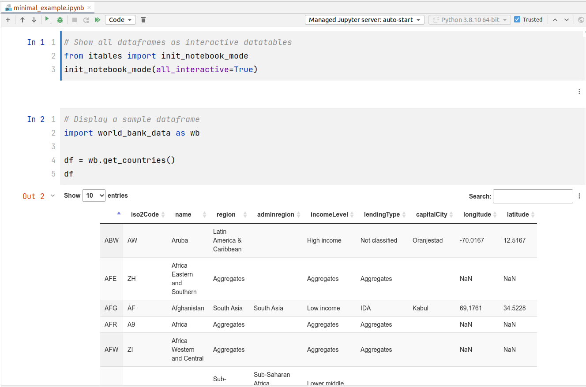

# Supported Notebook Editors

`itables` has been tested in many development environments.

## Jupyter Notebook

Try it on [](https://mybinder.org/v2/gh/mwouts/itables/main?filepath=docs/quick_start.md)



## Jupyter Lab

Try it on [](https://mybinder.org/v2/gh/mwouts/itables/main?urlpath=lab/tree/docs/quick_start.md)



## Jupyter NB convert

The tables are still interactive when you _download_ the notebook as an HTML file, or when you execute `jupyter nbconvert --to html`.



## Jupyter Book

The tables are interactive in interactive books powered by [Jupyter Book](https://jupyterbook.org), see e.g. the [ITables documentation](https://mwouts.github.io/itables/).

## Google Colab

A short sample notebook is available [here](https://colab.research.google.com/drive/1JPZIasTiH3rIUysDr3eWDz4jgTTq00aq?usp=sharing)



## VS Code

In VS Code, `itables` works both for Jupyter Notebooks and Python scripts



## PyCharm

In PyCharm we recommend to call `init_notebook_mode` with the `connected=True` argument,
because otherwise the notebooks do not display the interactive tables when they are reloaded.



# Exporting a DataFrame to an HTML table

To get the HTML representation of a Pandas DataFrame `df` as an interactive [datatable](https://datatables.net/), you can use `to_html_datatable` as below:
```python
from itables import to_html_datatable as DT
from itables.sample_dfs import get_countries

df = get_countries()
html = DT(df)
```

# Using ITables in Shiny

You can use ITables in Web applications generated with [Shiny](https://shiny.rstudio.com/py/) for Python, see our [tested examples](https://github.com/mwouts/itables/tree/main/tests/sample_python_apps).

ITables can't be used in Dash because jQuery is not usable in Dash (see the [Dash FAQ](https://dash.plotly.com/faqs)).
