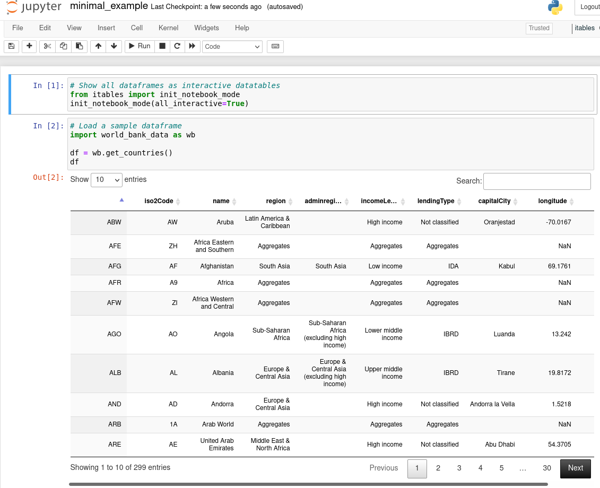
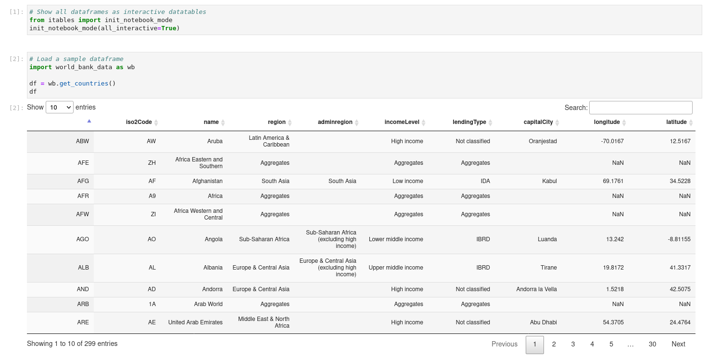
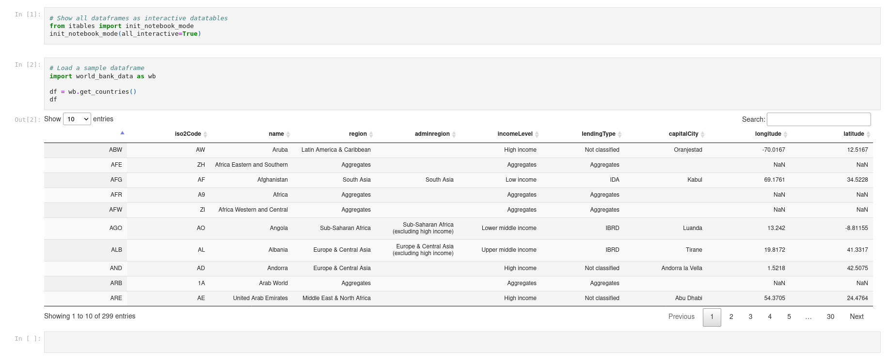
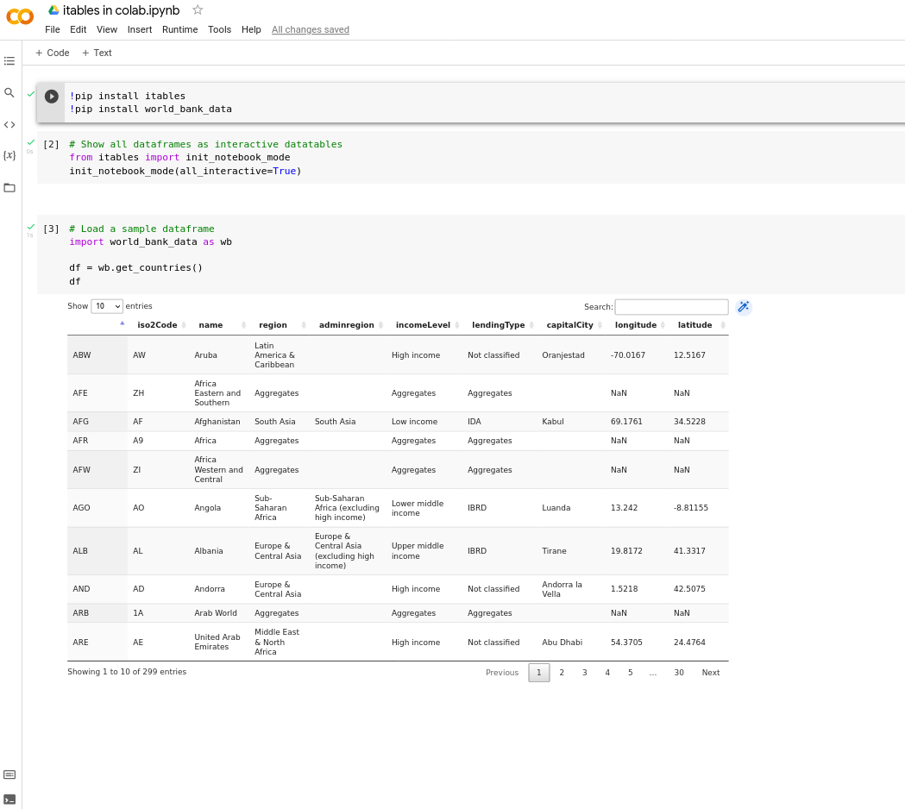
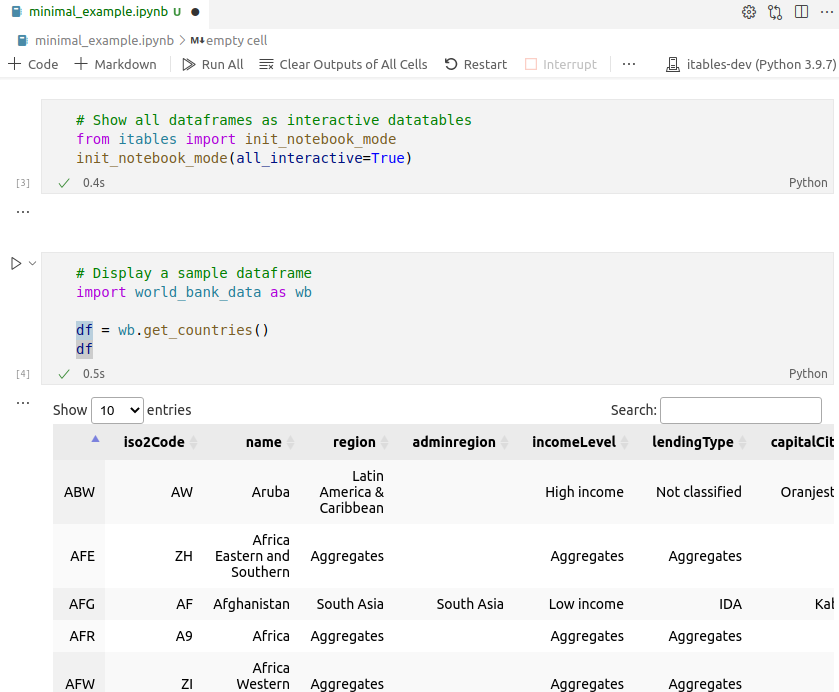
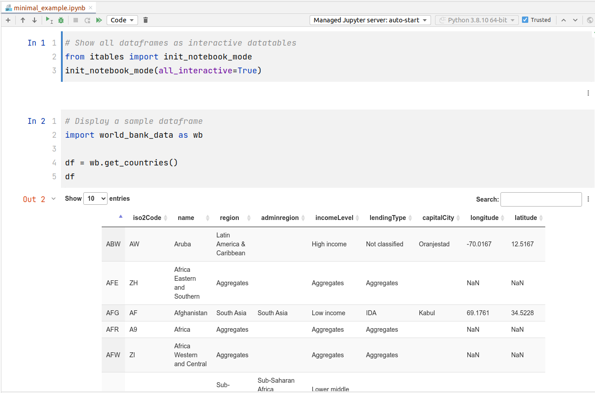

# Supported Editors

ITables has been tested in the following environments

## Jupyter Notebook

Try it on 

## Jupyter Lab

Try it on 

## Jupyter NB convert

The tables are still interactive when you _download_ the notebook as an HTML file, or when you execute `jupyter nbconvert --to html`.

## Jupyter Book

The tables are interactive in interactive books powered by [Jupyter Book](https://jupyterbook.org), see e.g. the [ITables documentation](https://mwouts.github.io/itables/).

## Google Colab

A short sample notebook is available [here](https://colab.research.google.com/drive/1JPZIasTiH3rIUysDr3eWDz4jgTTq00aq?usp=sharing)

## VS Code

In VS Code, `itables` works both for Jupyter Notebooks and Python scripts.

## PyCharm

In PyCharm we recommend to call `init_notebook_mode` with the `connected=True` argument,
because otherwise the notebooks do not display the interactive tables when they are reloaded.

## Quarto

ITables works well with Quarto - check out our `html` and `revealjs` [examples](apps/quarto.md).

<iframe src=quarto_revealjs.html width="750px" height="500px"></iframe>
